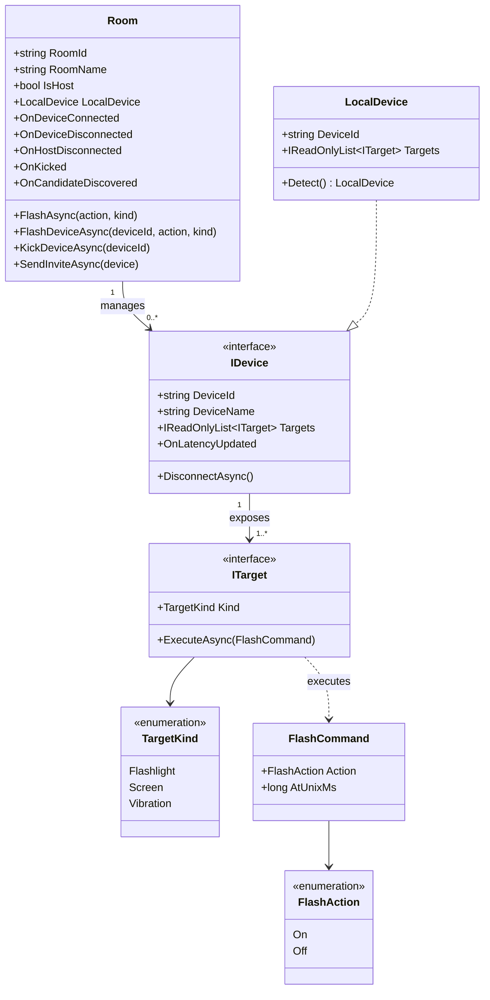
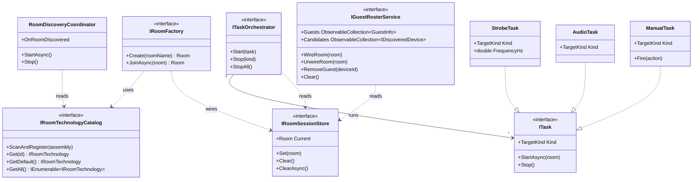
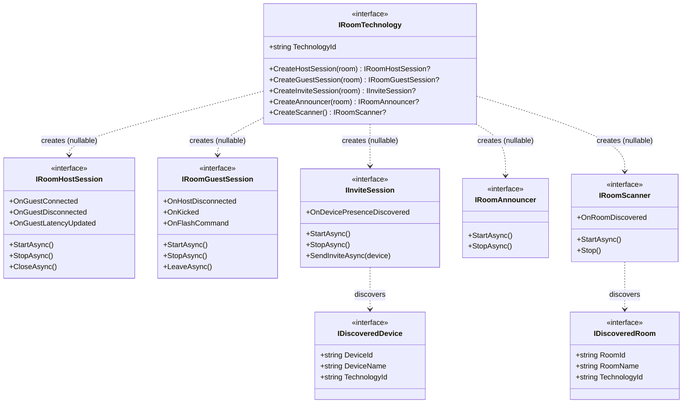
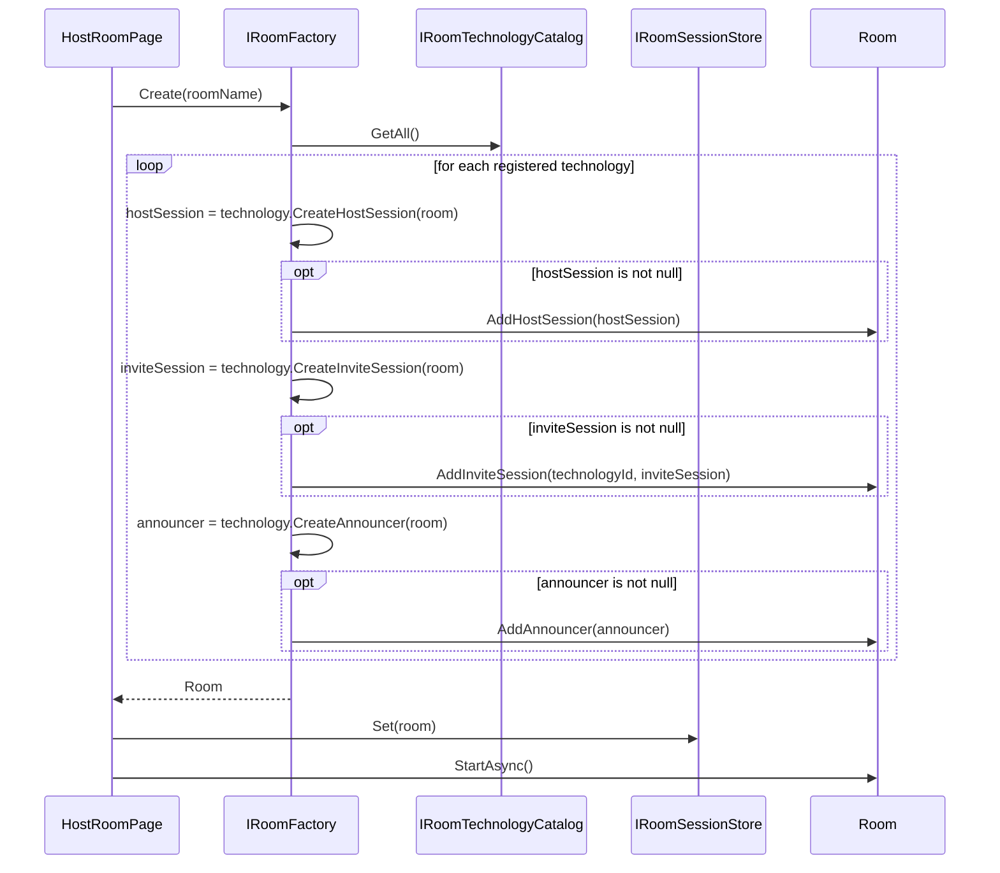
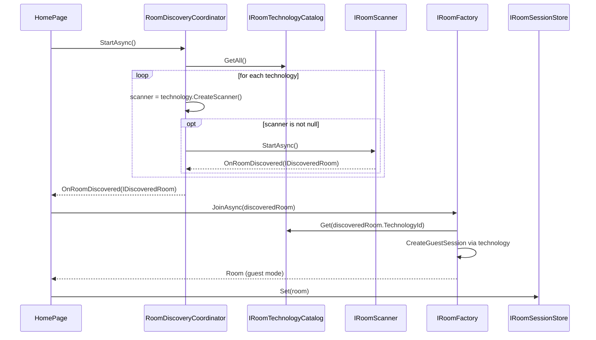
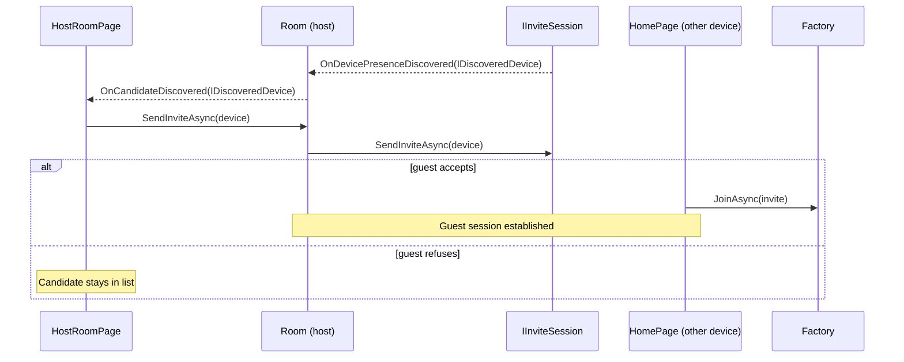
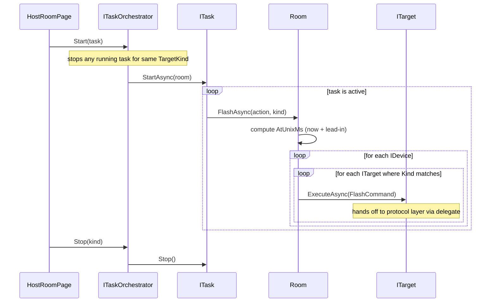
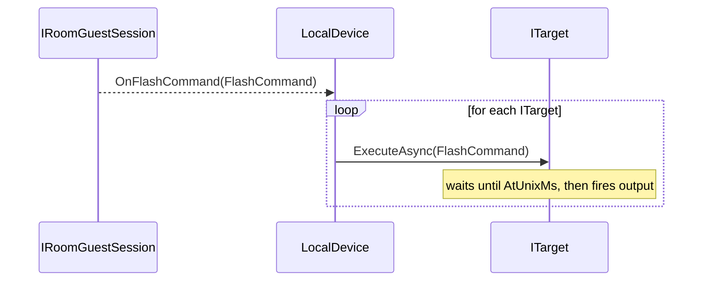
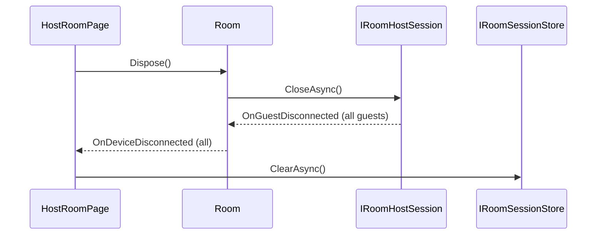

# Luso Architecture

This document defines the **target architecture** for the Luso application.  
It is the canonical reference — the codebase should be shaped to reflect it.

Luso enables synchronized multi-device light show playback in a **star topology**.  
One **Host** controls one or more **Guest** devices over a shared local network.

---

## 1. Architectural principles

- **Domain isolation** — `Room` is pure domain; it has zero knowledge of protocols or infrastructure.
- **Protocol agnosticism** — Commands flow through abstract interfaces (`ITarget`, `IDevice`, `IRoomHostSession`). No concrete protocol type ever appears in the domain or pages.
- **Technology registry** — Protocol implementations self-register via the `[RoomTechnology]` attribute. No central switch statement or factory condition needed.
- **Dependency injection** — All services are composed at application startup via MAUI's `IServiceCollection`. Pages receive services through DI.
- **Capability-aware dispatch** — Each device exposes a list of `ITarget` instances typed by `TargetKind`. Commands only reach targets that support the requested output.
- **Task-driven output** — The host controls targets through `ITask` instances managed by `ITaskOrchestrator`. Each task owns one `TargetKind` and drives `Room` commands over its lifetime. Multiple tasks can run concurrently across different target kinds.

---

## 2. Layer map

```
Pages (UI)
  └── Application Services
        └── Domain
              └── Protocol Abstractions (interfaces)
                    └── Protocol Implementations   ← self-registered via [RoomTechnology]
```

| Layer | Responsibility | Examples |
|---|---|---|
| **Pages** | User interaction, navigation | `HomePage`, `HostRoomPage`, `GuestRoomPage` |
| **Application Services** | Orchestrate domain and UI state | `IRoomFactory`, `IRoomSessionStore`, `ITaskOrchestrator`, `IGuestRosterService` |
| **Domain** | Pure session and command model | `Room`, `IDevice`, `ITarget`, `FlashCommand` |
| **Protocol Abstractions** | Interfaces the domain uses to talk to any transport | `IRoomHostSession`, `IRoomGuestSession`, `IInviteSession`, `IRoomAnnouncer`, `IRoomScanner` |
| **Protocol Implementations** | Concrete technology drivers, self-registered via `[RoomTechnology]` | `SspRoomTechnology` (room provider), `HueRoomTechnology` (invite-only device provider) |

---

## 3. Technology registry

Protocol implementations (**technologies**) self-register by decorating their entry class with `[RoomTechnology]`.

```csharp
[RoomTechnology("ssp")]
internal sealed class SspRoomTechnology : IRoomTechnology { ... }

[RoomTechnology("hue")]
internal sealed class HueRoomTechnology : IRoomTechnology { ... }
```

At startup, `IRoomTechnologyCatalog.ScanAndRegister(assembly)` discovers all decorated classes.  
`IRoomFactory` iterates `catalog.GetAll()` and uses only the capabilities each technology actually supports.

### Optional capabilities via nullable factories

Not all technologies support the same role. `IRoomTechnology` factory methods are nullable; returning `null` means the capability is not supported for that technology.

| Method | Returns `null` | Effect |
|---|---|---|
| `CreateHostSession(room)` | Yes | Technology cannot host/create a room |
| `CreateGuestSession(room)` | Yes | Technology cannot join rooms as guest session |
| `CreateAnnouncer(room)` | Yes | Room is not announced; guests join via invite/direct routing |
| `CreateScanner()` | Yes | Technology provides no protocol-level discovery signals |

When a room is created, `IRoomFactory`:
- Starts a **host session** only when `CreateHostSession(room)` returns non-null
- Starts an **invite session** only when `CreateInviteSession(room)` returns non-null
- Starts a **room announcer** only when `CreateAnnouncer(room)` returns non-null

This allows invite-only protocols (e.g., Hue bridge integration) to participate as **candidate/device providers** without ever creating or hosting a room.

Adding a new transport requires **only** a new `[RoomTechnology]` class — no changes to `RoomFactory`, `Room`, or any page.

---

## 4. Class diagrams

### 4.1 Domain model



### 4.2 Application services



### 4.3 Protocol abstractions



---

## 5. Sequence diagrams

All sequence diagrams are **protocol-agnostic** — they express flows in terms of domain and application-service interfaces only.

### 5.1 Host creates a room



### 5.2 Guest discovers and joins a room



### 5.3 Invite flow



### 5.4 Host runs a task



### 5.5 Guest receives and executes a command



### 5.6 Host closes the room



---

## 6. Project structure

```
Luso/
├── MauiProgram.cs                     ← DI composition root
├── Pages/                             ← all pages and page-specific views
│   ├── Home/
│   └── Rooms/
├── Components/                        ← reusable UI components only
│   ├── BottomBar/
│   └── Inputs/
├── Core/                              ← core systems (protocol-agnostic)
│   ├── RoomSystem/
│   │   ├── Domain/                    ← Room, IDevice, ITarget, command models
│   │   ├── Application/               ← IRoomFactory, ITaskOrchestrator, IGuestRosterService
│   │   ├── Discovery/                 ← RoomDiscoveryCoordinator, invite orchestration
│   │   └── Contracts/                 ← IRoomTechnology, IRoomHostSession, etc.
│   ├── SessionSystem/
│   │   └── IRoomSessionStore.cs
│   ├── TaskSystem/
│   │   ├── ITask.cs
│   │   ├── ITaskOrchestrator.cs
│   │   └── Tasks/                     ← StrobeTask, AudioTask, ManualTask
│   └── RegistrySystem/
│       ├── IRoomTechnologyCatalog.cs
│       ├── RoomTechnologyRegistry.cs
│       └── RoomTechnologyAttribute.cs
└── Protocols/                         ← each protocol is self-contained
    ├── Ssp/
    │   ├── SspRoomTechnology.cs       ← [RoomTechnology("ssp")]
    │   ├── Sessions/                  ← host/guest session implementations
    │   ├── Discovery/                 ← scanner/announcer/invite transport
    │   ├── Devices/                   ← protocol-specific IDevice adapters
    │   └── Wire/                      ← CBOR/transport payload mapping
    └── Hue/
        ├── HueRoomTechnology.cs       ← invite-only device provider
        ├── Discovery/                 ← bridge and light scanning
        ├── Invite/                    ← invite/session adapter for Hue devices
        └── Devices/                   ← Hue device/target adapters
```

Rules:
- `Core` must not depend on `Protocols`.
- `Protocols` depends only on `Core.Contracts` and `Core.Domain` abstractions.
- `Pages` and `Components` must not import protocol-specific implementations.

---

## 7. Adding a new protocol

1. Create a class decorated with `[RoomTechnology("ble")]` implementing `IRoomTechnology`.
2. Implement `CreateHostSession`, `CreateGuestSession`, `CreateInviteSession`.
3. Implement `CreateAnnouncer` and `CreateScanner` — return `null` only for capabilities the technology truly does not support.
4. Done — no changes to `RoomFactory`, `Room`, or any page are needed.

**Examples:**

```csharp
// BLE — supports broadcast discovery
public IRoomAnnouncer? CreateAnnouncer(Room room) => new BleRoomAnnouncer(room);
public IRoomScanner?   CreateScanner()            => new BleRoomScanner();

// Hue — invite-only device provider (never hosts or joins rooms)
public IRoomHostSession?  CreateHostSession(Room room) => null;
public IRoomGuestSession? CreateGuestSession(Room room) => null;
public IInviteSession?    CreateInviteSession(Room room) => new HueInviteSession(room);
public IRoomAnnouncer? CreateAnnouncer(Room room) => null;
public IRoomScanner?   CreateScanner()            => new HueBridgeScanner();
```

The `[RoomTechnology]` attribute is scanned at startup by `IRoomTechnologyCatalog.ScanAndRegister(assembly)`.

---

## 8. Operational contracts (non-happy paths)

This section defines expected behavior for real-world failures and ambiguous flows.

### 8.1 Crash/disconnect handling

- **Host crash/disconnect:** Guests detect loss via heartbeat timeout and close `GuestRoom`.
- **Guest crash/disconnect:** Host detects loss via heartbeat timeout, removes the device from `Room` and from target dispatch.
- **Task cleanup on guest loss:** Running tasks are reevaluated against currently available targets. A task is removed/stopped **only** when it has zero eligible targets.

### 8.2 Join and session lifecycle

- Guest lifecycle is **fresh join only**. Rejoin/resume is out of scope for now.
- New targets/devices do not receive any implicit “current task state”. They only receive commands emitted after they are connected.
- If identity metadata changes (e.g., protocol meta such as IP), the peer is treated as a **new device**.
- Invite-only device providers (e.g., Hue bridge integration) never create rooms and never act as host room sessions.

### 8.3 Device identity

- Device identity is protocol-aware and deterministic.
- Recommended composite identity shape: `{name}:{protocol}:{protocolMeta}`.
- Example protocol metadata: SSP uses guest IP (or equivalent transport identity).
- Identity changes are modeled as new device identities; no in-place identity mutation/merge is required in current scope.

### 8.4 Execution responsibility and guarantees

- Host is an orchestrator/dispatcher only.
- Guest is responsible for command execution on a **best-effort** basis.
- Command flow is one-way; host does not require guest execution acknowledgements.
- Partial execution across guests is acceptable in current scope.
- Host UX does not show execution-disclaimer warnings; operators validate behavior by observing/hearing connected devices.

### 8.5 Capabilities and permissions

- Capabilities are declared by guest at connection time and treated as stable for the session.
- Permission/authorization failures on a guest are guest-local concerns.
- Host remains agnostic to guest runtime permission state.

### 8.6 Security ownership

- Security is owned by each protocol implementation.
- `Room` and task orchestration remain protocol-agnostic and do not enforce transport security policy directly.
- Cross-protocol shared security contracts are on hold for now.

### 8.7 Deferred topics (explicitly later)

- Cross-device clock synchronization strategy
- Synchronization tolerance/SLA targets
- Duplicate/out-of-order command handling and stronger delivery semantics
- Extended observability/telemetry contract
- Background execution hardening and reconnection strategies