# Luso Session Protocol — SSP/1.0

> **Status:** Specification (target design)  
> **Encoding:** CBOR (RFC 7049) — binary, compact, RFC-standard  
> **Framing (TCP):** CBOR Sequences (RFC 8742) — each message is one self-delimiting CBOR item  
> **Framing (UDP):** one CBOR item per datagram (naturally self-bounded)  
> **Current implementation baseline:** v0 — newline-delimited UTF-8 JSON (migration target: SSP/1.0)
> **Pre-V1 policy:** this specification is mutable; breaking protocol changes are allowed until V1.

---

## 1. Overview

Luso operates as a **star topology** over a shared LAN/Wi-Fi network.  
One device acts as **Host**, all others act as **Guests**.

```
Guest A ──┐
Guest B ──┼──► Host
Guest C ──┘
```

Communication uses two independent channels:

| Channel | Protocol | Port | Purpose |
|---|---|---|---|
| Discovery | UDP broadcast/unicast | **5557** | Room announcements, guest presence, host invites |
| Session | TCP (per guest) | **13000** | Bidirectional command stream |

---

## 2. Encoding

All messages are encoded as **CBOR maps** (major type 5).

### 2.1 Key conventions

- All map keys are **short UTF-8 text strings** (minimise overhead).
- The field `t` is always the **first key**, containing a **4-character ASCII type tag**.
- Boolean fields use CBOR `true` / `false` (major type 7).
- Integer timestamps are **unsigned 64-bit integers** (Unix epoch, millisecond precision).
- Unsigned short integers use the smallest CBOR integer encoding that fits.
- Text strings use CBOR major type 3 (UTF-8).

### 2.2 CBOR Sequences (TCP)

TCP delivers a continuous byte stream.  
Each message is one complete CBOR item, written back-to-back with no separator.  
The receiver uses a streaming CBOR decoder; it reads one item at a time.

```
[CBOR item 1][CBOR item 2][CBOR item 3] …
```

> ⚠ Do NOT use newline (`0x0A`) as a delimiter — CBOR binary data may contain that byte.

---

## 3. Discovery Protocol (UDP)

### 3.1 Transport

- **Directions:** Host ↔ Guest over UDP (broadcast for discovery, unicast for invite responses)  
- **Broadcast address:** `255.255.255.255:5557`  
- **Host ANNC rate:** every 2 000 ms while the room is open  
- **Guest PRES rate:** every 3 000 ms while guest is available for invites  
- **All peers** listen on `0.0.0.0:5557`

### 3.2 Message: `ANNC` — Room Announcement

Sent by the Host to advertise a room on the network.

| Field | Key | CBOR type | Description |
|---|---|---|---|
| Type tag | `t` | text | `"ANNC"` |
| Room ID | `id` | text | Unique room identifier (UUID or nanoid) |
| Room name | `nm` | text | Human-readable room name |
| Host IP | `ip` | text | IPv4 address, dotted decimal |
| TCP port | `pt` | uint | Session port (default 13000) |

**CBOR hex example** (`nm = "Stage"`, `pt = 13000`, abbreviated IDs):

```
a5                        # map(5)
  61 74                   # key "t"
  64 414e4e43             # text "ANNC"
  62 6964                 # key "id"
  78 24 ...               # text "<uuid>"
  62 6e6d                 # key "nm"
  65 5374616765           # text "Stage"
  62 6970                 # key "ip"
  6b 31302e302e322e3136   # text "10.0.2.16"
  62 7074                 # key "pt"
  19 32c8                 # uint 13000
```

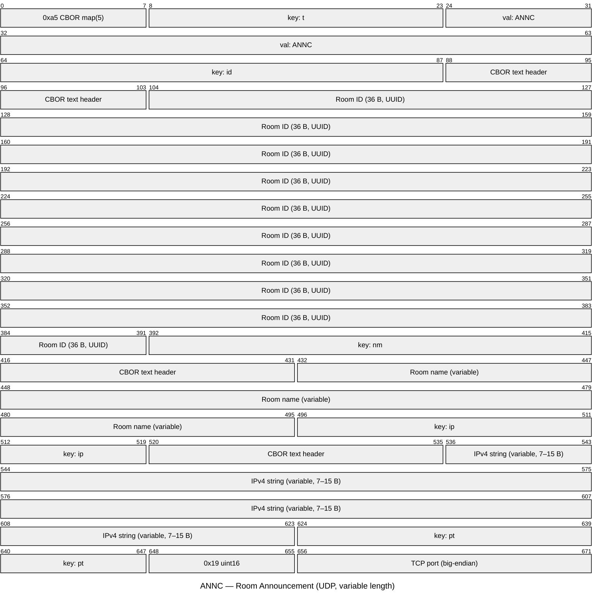
```mermaid
packet
title ANNC — Room Announcement (UDP, variable length)
+8: "0xa5 CBOR map(5)"
+16: "key: t"
+40: "val: ANNC"
+24: "key: id"
+16: "CBOR text header"
+288: "Room ID (36 B, UUID)"
+24: "key: nm"
+16: "CBOR text header"
+64: "Room name (variable)"
+24: "key: ip"
+16: "CBOR text header"
+88: "IPv4 string (variable, 7–15 B)"
+24: "key: pt"
+8: "0x19 uint16"
+16: "TCP port (big-endian)"
```

### 3.3 Sequence — Discovery

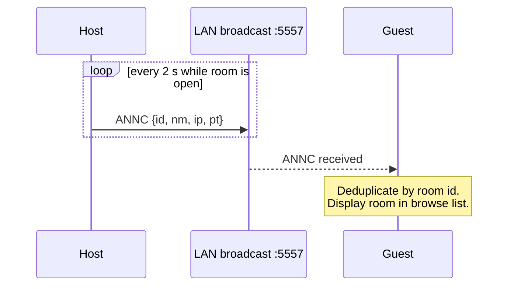
```mermaid
sequenceDiagram
    participant H as Host
    participant LAN as LAN broadcast :5557
    participant G as Guest

    loop every 2 s while room is open
        H->>LAN: ANNC {id, nm, ip, pt}
    end

    LAN-->>G: ANNC received
    Note over G: Deduplicate by room id.<br/>Display room in browse list.
```

### 3.4 Message: `PRES` — Guest Presence

Sent by a Guest to advertise itself as an invite candidate.

| Field | Key | CBOR type | Description |
|---|---|---|---|
| Type tag | `t` | text | `"PRES"` |
| Guest ID | `gid` | text | Stable guest identifier |
| Guest name | `nm` | text | Human-readable guest device name |
| Guest IP | `ip` | text | IPv4 address, dotted decimal |
| Protocol version | `pv` | text | Supported protocol version, e.g. `"1.0"` |
| Availability | `av` | bool | `true` when ready to receive invites |

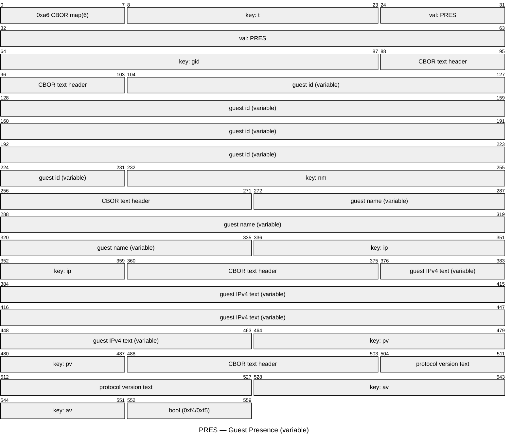
```mermaid
packet
title PRES — Guest Presence (variable)
+8: "0xa6 CBOR map(6)"
+16: "key: t"
+40: "val: PRES"
+24: "key: gid"
+16: "CBOR text header"
+128: "guest id (variable)"
+24: "key: nm"
+16: "CBOR text header"
+64: "guest name (variable)"
+24: "key: ip"
+16: "CBOR text header"
+88: "guest IPv4 text (variable)"
+24: "key: pv"
+16: "CBOR text header"
+24: "protocol version text"
+24: "key: av"
+8: "bool (0xf4/0xf5)"
```

### 3.5 Message: `INVI` — Host Invite

Sent by Host (UDP unicast) to a discovered Guest from `PRES`.

| Field | Key | CBOR type | Description |
|---|---|---|---|
| Type tag | `t` | text | `"INVI"` |
| Invite ID | `iid` | text | Unique invite identifier |
| Room ID | `id` | text | Target room identifier |
| Room name | `nm` | text | Target room name |
| Host IP | `ip` | text | Host IPv4 address |
| TCP port | `pt` | uint | Target room TCP port |
| Protocol version | `pv` | text | Required protocol version, e.g. `"1.0"` |

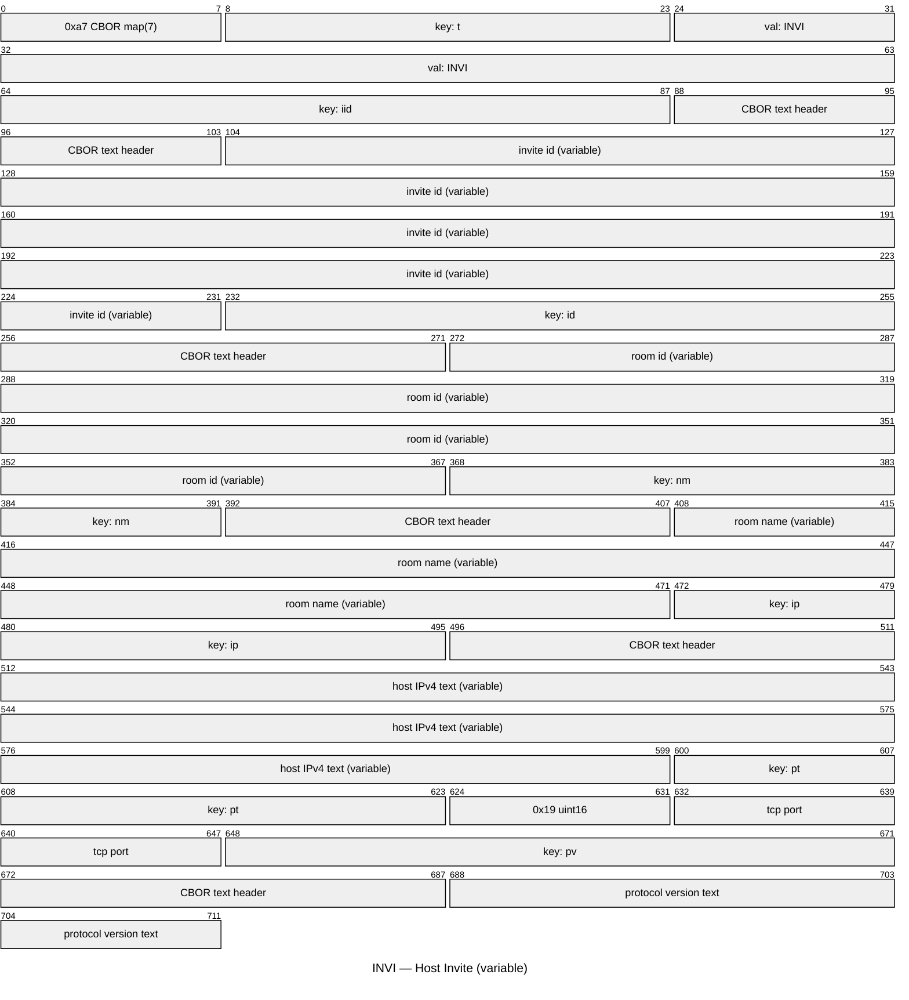
```mermaid
packet
title INVI — Host Invite (variable)
+8: "0xa7 CBOR map(7)"
+16: "key: t"
+40: "val: INVI"
+24: "key: iid"
+16: "CBOR text header"
+128: "invite id (variable)"
+24: "key: id"
+16: "CBOR text header"
+96: "room id (variable)"
+24: "key: nm"
+16: "CBOR text header"
+64: "room name (variable)"
+24: "key: ip"
+16: "CBOR text header"
+88: "host IPv4 text (variable)"
+24: "key: pt"
+8: "0x19 uint16"
+16: "tcp port"
+24: "key: pv"
+16: "CBOR text header"
+24: "protocol version text"
```

### 3.6 Message: `INVR` — Invite Response (refuse)

Sent by Guest (UDP unicast) when invite is refused.

| Field | Key | CBOR type | Description |
|---|---|---|---|
| Type tag | `t` | text | `"INVR"` |
| Invite ID | `iid` | text | Invite identifier being answered |
| Guest ID | `gid` | text | Refusing guest identifier |
| Reason | `rsn` | text | Optional refusal reason (`"busy"`, `"user_refused"`, `"version"`) |

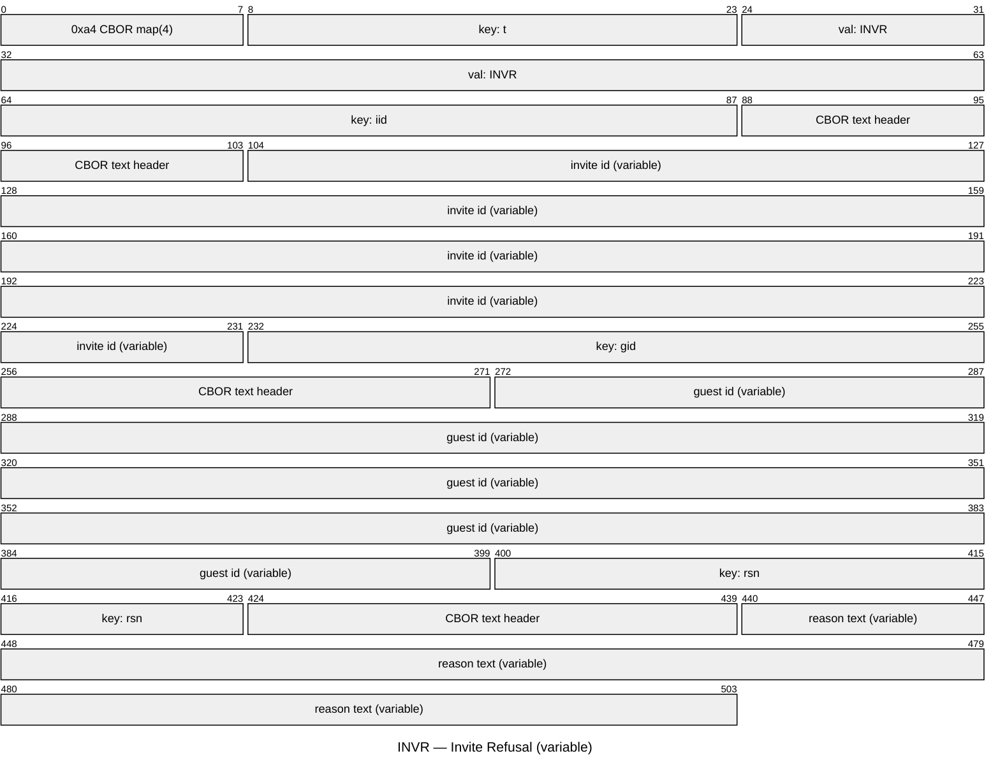
```mermaid
packet
title INVR — Invite Refusal (variable)
+8: "0xa4 CBOR map(4)"
+16: "key: t"
+40: "val: INVR"
+24: "key: iid"
+16: "CBOR text header"
+128: "invite id (variable)"
+24: "key: gid"
+16: "CBOR text header"
+128: "guest id (variable)"
+24: "key: rsn"
+16: "CBOR text header"
+64: "reason text (variable)"
```

### 3.7 Sequence — Invite to join or refuse

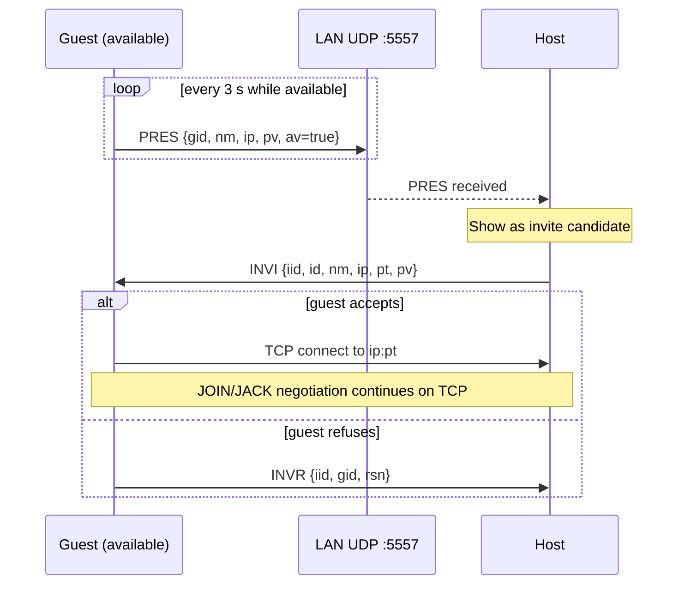
```mermaid
sequenceDiagram
    participant G as Guest (available)
    participant LAN as LAN UDP :5557
    participant H as Host

    loop every 3 s while available
        G->>LAN: PRES {gid, nm, ip, pv, av=true}
    end

    LAN-->>H: PRES received
    Note over H: Show as invite candidate

    H->>G: INVI {iid, id, nm, ip, pt, pv}
    alt guest accepts
        G->>H: TCP connect to ip:pt
        Note over G,H: JOIN/JACK negotiation continues on TCP
    else guest refuses
        G->>H: INVR {iid, gid, rsn}
    end
```

---

## 4. Session Protocol (TCP)

### 4.1 Transport

- Guest opens a TCP connection to `Host IP : TCP port` (from ANNC).
- The Host accepts on `0.0.0.0:13000`.
- The connection is **persistent** for the lifetime of the guest session.
- Both sides write CBOR Sequences; both sides read CBOR Sequences concurrently.

### 4.2 Message types

| Tag | Direction | Role |
|---|---|---|
| `JOIN` | G → H | Guest join request (capabilities) |
| `JACK` | H → G | Join acknowledged |
| `JNAK` | H → G | Join refused (including protocol mismatch) |
| `PING` | H → G | Heartbeat probe |
| `PONG` | G → H | Heartbeat reply |
| `FLSH` | H → G | Scheduled flash/effect command |
| `KICK` | H → G | Host forcibly removes one guest |
| `CLOS` | H → G | Host closing room (graceful) |
| `LEAV` | G → H | Guest leaving voluntarily (graceful) |

---

### 4.3 Handshake

#### `JOIN` — Guest join request

Sent by the Guest **immediately after TCP connect**, before any other message.

| Field | Key | CBOR type | Description |
|---|---|---|---|
| Type tag | `t` | text | `"JOIN"` |
| Protocol version | `pv` | text | Guest protocol version, e.g. `"1.0"` |
| Device name | `nm` | text | Human-readable guest device name |
| Capabilities | `cap` | map | See §4.4 |

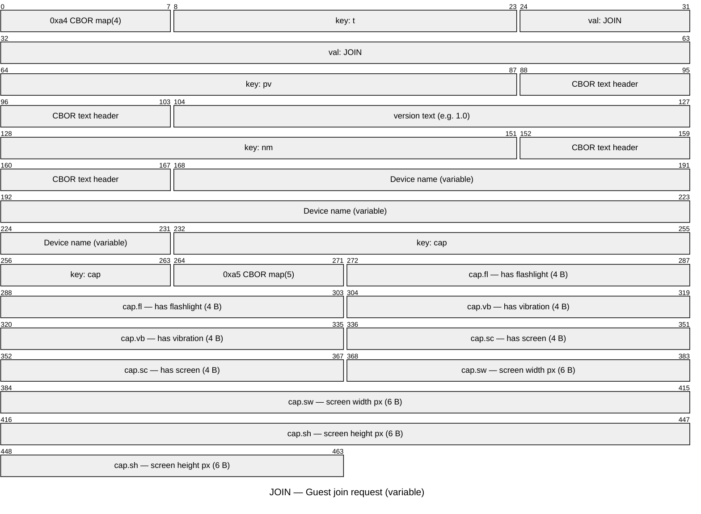
```mermaid
packet
title JOIN — Guest join request (variable)
+8: "0xa4 CBOR map(4)"
+16: "key: t"
+40: "val: JOIN"
+24: "key: pv"
+16: "CBOR text header"
+24: "version text (e.g. 1.0)"
+24: "key: nm"
+16: "CBOR text header"
+64: "Device name (variable)"
+32: "key: cap"
+8: "0xa5 CBOR map(5)"
+32: "cap.fl — has flashlight (4 B)"
+32: "cap.vb — has vibration (4 B)"
+32: "cap.sc — has screen (4 B)"
+48: "cap.sw — screen width px (6 B)"
+48: "cap.sh — screen height px (6 B)"
```

#### `JACK` — Join acknowledged

Sent by the Host in reply to a valid `JOIN`.

| Field | Key | CBOR type | Description |
|---|---|---|---|
| Type tag | `t` | text | `"JACK"` |
| Protocol version | `pv` | text | Host protocol version, e.g. `"1.0"` |
| Room name | `nm` | text | Confirmed room name |
| Room ID | `id` | text | Confirmed room ID |

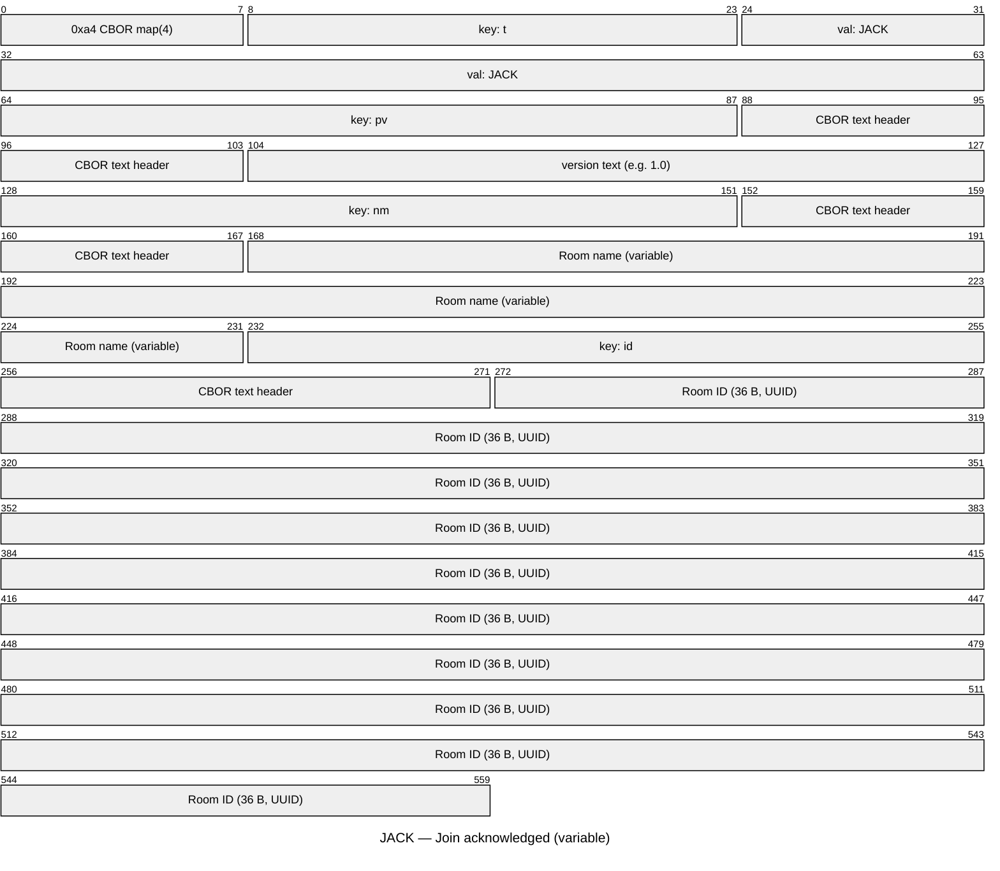
```mermaid
packet
title JACK — Join acknowledged (variable)
+8: "0xa4 CBOR map(4)"
+16: "key: t"
+40: "val: JACK"
+24: "key: pv"
+16: "CBOR text header"
+24: "version text (e.g. 1.0)"
+24: "key: nm"
+16: "CBOR text header"
+64: "Room name (variable)"
+24: "key: id"
+16: "CBOR text header"
+288: "Room ID (36 B, UUID)"
```

#### `JNAK` — Join refused

Sent by Host when JOIN is invalid or unsupported.

| Field | Key | CBOR type | Description |
|---|---|---|---|
| Type tag | `t` | text | `"JNAK"` |
| Error code | `ec` | text | `"PROTOCOL_MISMATCH"`, `"ROOM_CLOSED"`, `"AUTH_FAILED"` |
| Message | `msg` | text | Human-readable reason |
| Host protocol version | `pv` | text | Host protocol version |

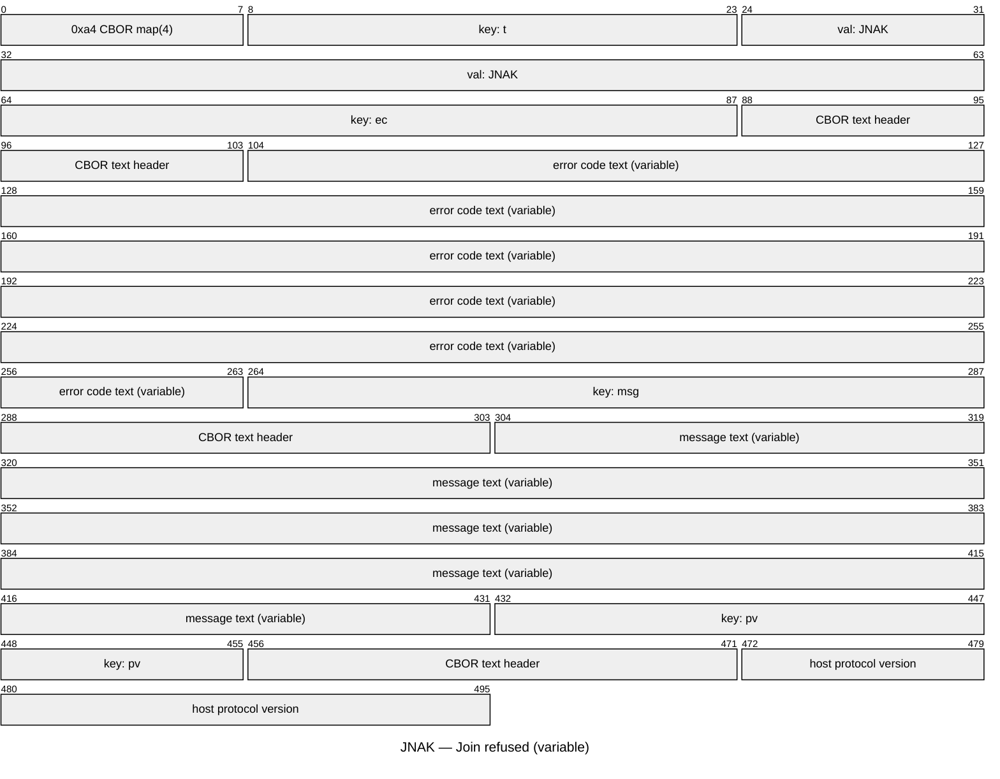
```mermaid
packet
title JNAK — Join refused (variable)
+8: "0xa4 CBOR map(4)"
+16: "key: t"
+40: "val: JNAK"
+24: "key: ec"
+16: "CBOR text header"
+160: "error code text (variable)"
+24: "key: msg"
+16: "CBOR text header"
+128: "message text (variable)"
+24: "key: pv"
+16: "CBOR text header"
+24: "host protocol version"
```

Protocol negotiation rule:
- Guest sends `JOIN.pv`.
- Host compares against its own supported version.
- If versions are equal, Host returns `JACK.pv` with same version.
- If versions differ, Host MUST return `JNAK` with `ec = "PROTOCOL_MISMATCH"` and close the connection.

> If the Host does not send `JACK` or `JNAK` within 5 000 ms, the Guest MUST close the connection and report a join failure.

### 4.4 Capabilities map (`cap`)

Sent inside `JOIN`. Describes what the guest device can execute.

| Field | Key | CBOR type | Description |
|---|---|---|---|
| Has flashlight | `fl` | bool | Device has a usable rear flashlight |
| Has vibration | `vb` | bool | Device supports haptic/vibration output |
| Has screen | `sc` | bool | Device can display full-screen effects |
| Screen width | `sw` | uint | Screen width in pixels (0 if `sc = false`) |
| Screen height | `sh` | uint | Screen height in pixels (0 if `sc = false`) |

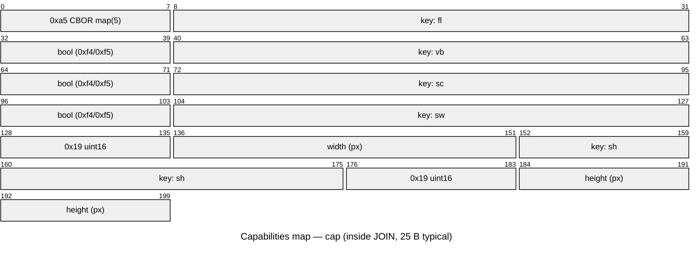
```mermaid
packet
title Capabilities map — cap (inside JOIN, 25 B typical)
+8: "0xa5 CBOR map(5)"
+24: "key: fl"
+8: "bool (0xf4/0xf5)"
+24: "key: vb"
+8: "bool (0xf4/0xf5)"
+24: "key: sc"
+8: "bool (0xf4/0xf5)"
+24: "key: sw"
+8: "0x19 uint16"
+16: "width (px)"
+24: "key: sh"
+8: "0x19 uint16"
+16: "height (px)"
```

> Future capabilities (audio output, LED strips, etc.) are added here as new keys. Unknown keys MUST be ignored by receivers.

---

### 4.5 Heartbeat

The Host probes each guest every **2 000 ms**.  
If no `PONG` is received within **6 000 ms**, the Host considers the guest lost and closes the slot.  
The Guest runs a watchdog: if no `PING` arrives within **6 000 ms**, it considers the Host lost and fires a disconnect event.

#### `PING` — Heartbeat probe  

| Field | Key | CBOR type | Description |
|---|---|---|---|
| Type tag | `t` | text | `"PING"` |
| Sent at | `ms` | uint64 | Sender Unix timestamp (ms) |

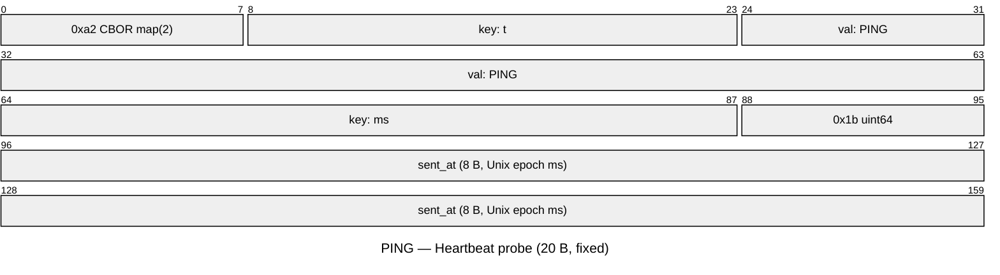
```mermaid
packet
title PING — Heartbeat probe (20 B, fixed)
+8: "0xa2 CBOR map(2)"
+16: "key: t"
+40: "val: PING"
+24: "key: ms"
+8: "0x1b uint64"
+64: "sent_at (8 B, Unix epoch ms)"
```

#### `PONG` — Heartbeat reply

| Field | Key | CBOR type | Description |
|---|---|---|---|
| Type tag | `t` | text | `"PONG"` |
| Sent at | `ms` | uint64 | Echo of `ms` from the `PING` |

> RTT (ms) = `now_ms − PONG.ms`. Computed by the Host upon receiving `PONG`.

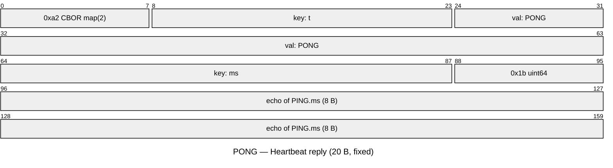
```mermaid
packet
title PONG — Heartbeat reply (20 B, fixed)
+8: "0xa2 CBOR map(2)"
+16: "key: t"
+40: "val: PONG"
+24: "key: ms"
+8: "0x1b uint64"
+64: "echo of PING.ms (8 B)"
```

---

### 4.6 Flash command

#### `FLSH` — Scheduled effect

Sent by the Host to all connected guests simultaneously.  
The field `at` is a future Unix timestamp (ms). All receivers execute the effect at that instant.  
The lead time (Host → Guest propagation allowance) is currently **500 ms**.

| Field | Key | CBOR type | Description |
|---|---|---|---|
| Type tag | `t` | text | `"FLSH"` |
| Action | `ac` | text | Effect identifier (see §4.6.1) |
| Execute at | `at` | uint64 | Target Unix timestamp (ms) |

##### 4.6.1 Action values (v1.0)

| Value | Meaning |
|---|---|
| `"on"` | Turn flashlight / screen on |
| `"off"` | Turn flashlight / screen off |
| `"strb"` | Begin stroboscope effect (parameters TBD in v1.1) |

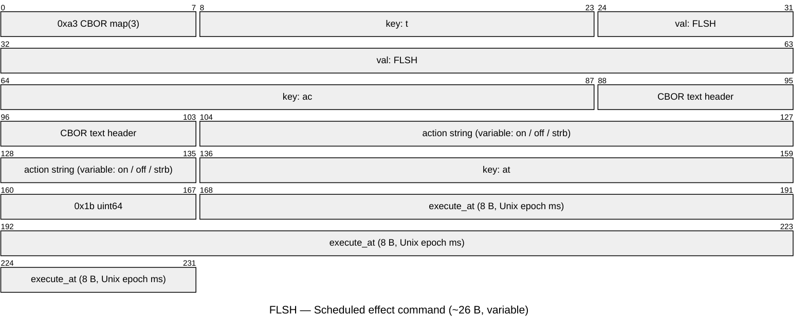
```mermaid
packet
title FLSH — Scheduled effect command (~26 B, variable)
+8: "0xa3 CBOR map(3)"
+16: "key: t"
+40: "val: FLSH"
+24: "key: ac"
+16: "CBOR text header"
+32: "action string (variable: on / off / strb)"
+24: "key: at"
+8: "0x1b uint64"
+64: "execute_at (8 B, Unix epoch ms)"
```

---

### 4.7 Disconnect control

#### `KICK` — Host forcibly removes one guest

Sent by the Host to a specific Guest to force immediate removal from the room.
Guest receiving `KICK` MUST stop session processing, show a "removed by host" message, and navigate away.

| Field | Key | CBOR type | Description |
|---|---|---|---|
| Type tag | `t` | text | `"KICK"` |
| Reason | `rsn` | text | Optional reason, default `"removed_by_host"` |

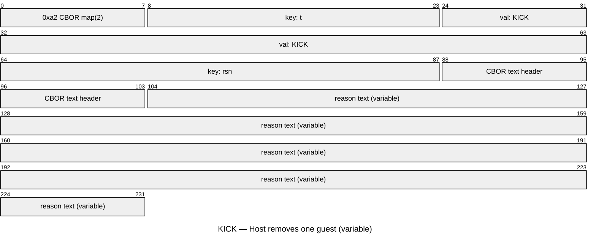
```mermaid
packet
title KICK — Host removes one guest (variable)
+8: "0xa2 CBOR map(2)"
+16: "key: t"
+40: "val: KICK"
+24: "key: rsn"
+16: "CBOR text header"
+128: "reason text (variable)"
```

#### `CLOS` — Host closes room

Sent by the Host to **all guests** before it shuts down the room.  
Guests receiving `CLOS` MUST display "Room closed by host" and navigate away. They MUST NOT send a `LEAV` reply.

| Field | Key | CBOR type | Description |
|---|---|---|---|
| Type tag | `t` | text | `"CLOS"` |

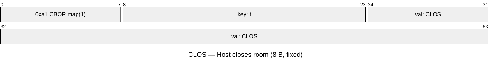
```mermaid
packet
title CLOS — Host closes room (8 B, fixed)
+8: "0xa1 CBOR map(1)"
+16: "key: t"
+40: "val: CLOS"
```

#### `LEAV` — Guest leaves voluntarily

Sent by the Guest when the user decides to leave the room.  
The Host removes the guest slot cleanly. The Host MUST NOT interpret `LEAV` as a network error.

| Field | Key | CBOR type | Description |
|---|---|---|---|
| Type tag | `t` | text | `"LEAV"` |

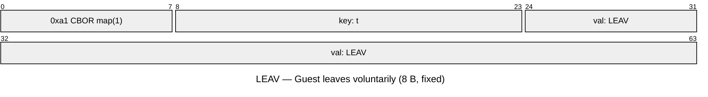
```mermaid
packet
title LEAV — Guest leaves voluntarily (8 B, fixed)
+8: "0xa1 CBOR map(1)"
+16: "key: t"
+40: "val: LEAV"
```

---

## 5. Sequence diagrams

### 5.1 Full session lifecycle

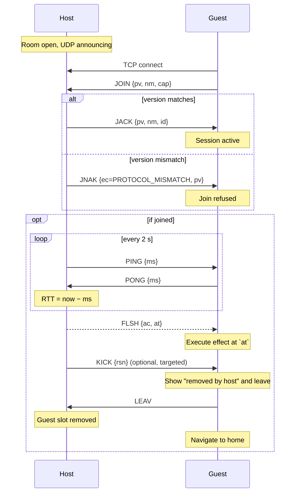
```mermaid
sequenceDiagram
    participant H as Host
    participant G as Guest

    Note over H: Room open, UDP announcing

    G->>H: TCP connect
    G->>H: JOIN {pv, nm, cap}
    alt version matches
        H->>G: JACK {pv, nm, id}
        Note over G: Session active
    else version mismatch
        H->>G: JNAK {ec=PROTOCOL_MISMATCH, pv}
        Note over G: Join refused
    end

    opt if joined
        loop every 2 s
            H->>G: PING {ms}
            G->>H: PONG {ms}
            Note over H: RTT = now − ms
        end

        H-->>G: FLSH {ac, at}
        Note over G: Execute effect at `at`

        H->>G: KICK {rsn} (optional, targeted)
        Note over G: Show "removed by host" and leave

        G->>H: LEAV
        Note over H: Guest slot removed
        Note over G: Navigate to home
    end
```

### 5.2 Host closes room

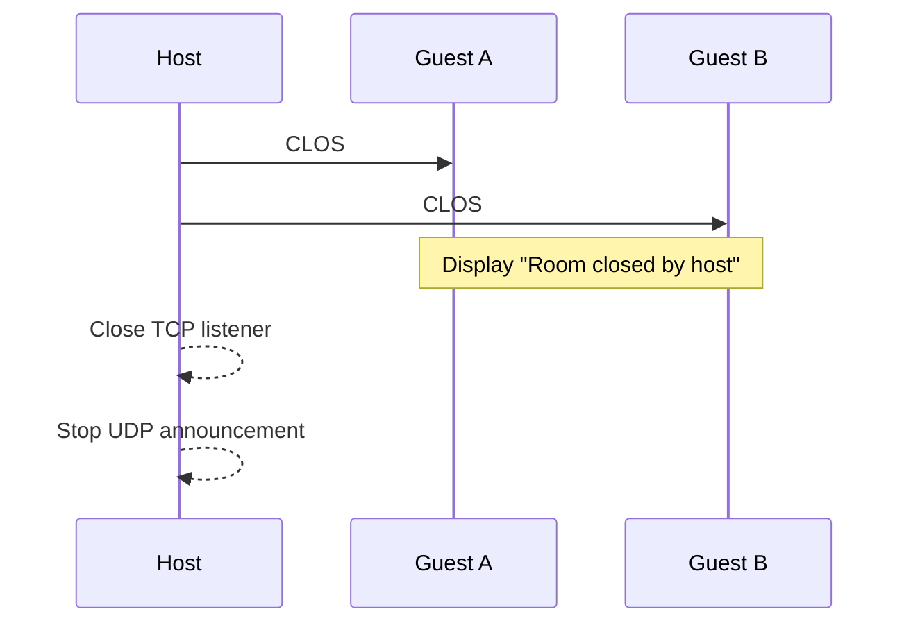
```mermaid
sequenceDiagram
    participant H as Host
    participant G1 as Guest A
    participant G2 as Guest B

    H->>G1: CLOS
    H->>G2: CLOS
    Note over G1,G2: Display "Room closed by host"
    H-->>H: Close TCP listener
    H-->>H: Stop UDP announcement
```

### 5.3 Guest timeout (network loss)

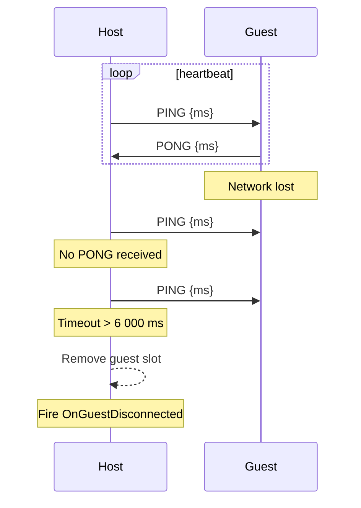
```mermaid
sequenceDiagram
    participant H as Host
    participant G as Guest

    loop heartbeat
        H->>G: PING {ms}
        G->>H: PONG {ms}
    end

    Note over G: Network lost

    H->>G: PING {ms}
    Note over H: No PONG received
    H->>G: PING {ms}
    Note over H: Timeout > 6 000 ms
    H-->>H: Remove guest slot
    Note over H: Fire OnGuestDisconnected
```

### 5.4 Host timeout (network loss — guest side)

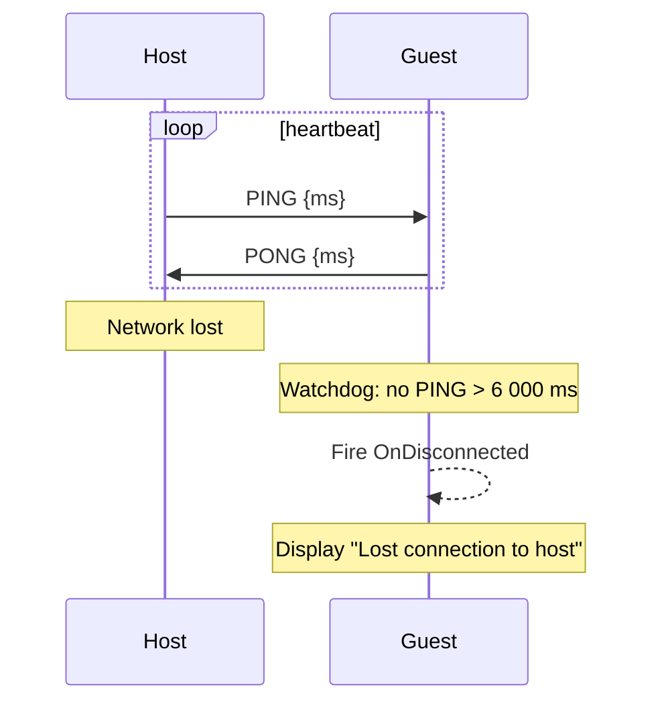
```mermaid
sequenceDiagram
    participant H as Host
    participant G as Guest

    loop heartbeat
        H->>G: PING {ms}
        G->>H: PONG {ms}
    end

    Note over H: Network lost

    Note over G: Watchdog: no PING > 6 000 ms
    G-->>G: Fire OnDisconnected
    Note over G: Display "Lost connection to host"
```

---

## 6. Port summary

| Port | Protocol | Direction | Usage |
|---|---|---|---|
| 5557 | UDP | Host ↔ Guest | Room discovery, guest presence, invites, invite refusal |
| 13000 | TCP | Host (listener) | Session per guest |

---

## 7. Implementation notes

### 7.1 Interoperability

Any external device or application implementing SSP/1.0 can:
- Discover rooms by listening on UDP port 5557 for `ANNC` datagrams.
- Join any room by opening a TCP connection to the announced IP:port and sending a `JOIN` message.
- Receive and execute `FLSH` commands based on local `at` timestamp.
- Handle host disconnect controls (`KICK` for targeted removal, `CLOS` for room shutdown).

The protocol is intentionally **platform-agnostic**: it requires only a UDP socket, a TCP socket, and a CBOR encoder/decoder.

---

## 8. Open items (to be specified in v1.1+)

| Topic | Notes |
|---|---|
| Stroboscope parameters | Frequency (Hz), duty cycle (%), duration (ms) — extend `FLSH` message |
| Effect sequences | Ordered list of `FLSH`-like commands with relative timing |
| Music trigger integration | FFT-based beat → effect trigger; timing handoff to protocol |
| Rule-based triggers | Condition/action model; not yet specified |
| Room authentication | PIN or token in `JOIN` for private rooms |
| Guest groups | Subset targeting within a room |
| Error message | `ERRO` type with code + description |
